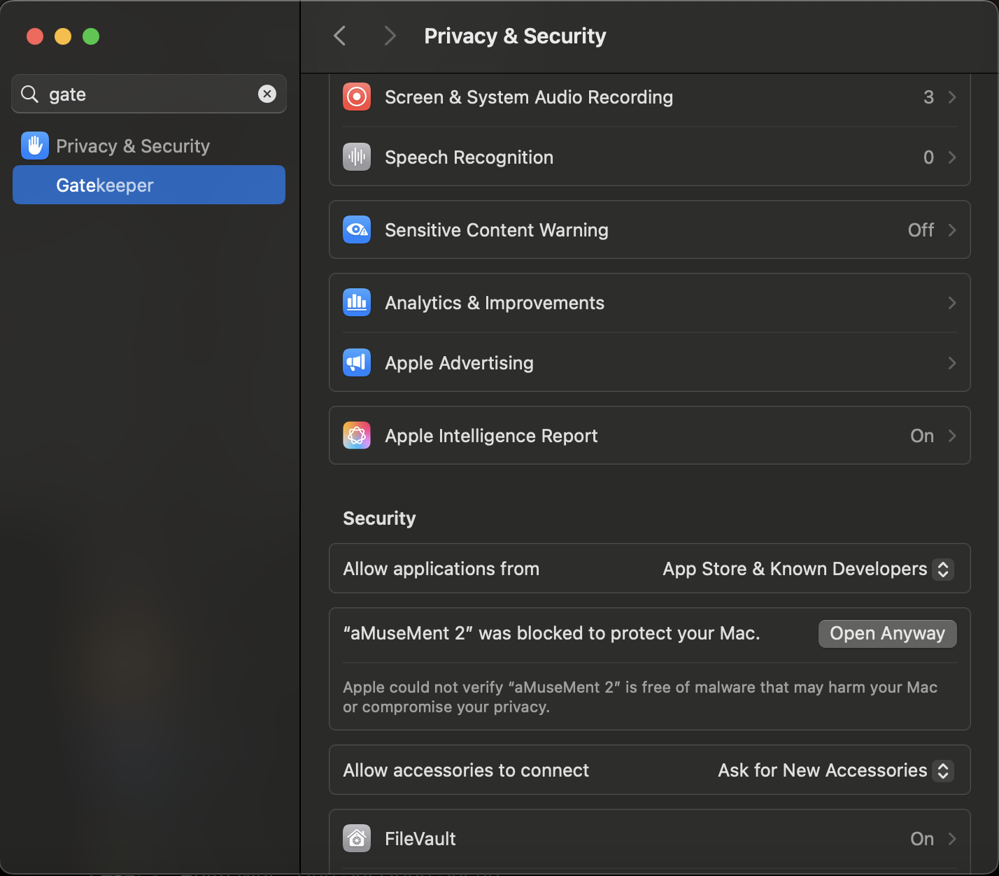

# aMuseMent
### A tool to download YouTube Music files and move them to iTunes/Apple Music

## Features
- 📁 Download directly from YouTube Music playlists at the highest quality possible!
- 📝 Music metadata prepared for you!
- 🎵 Add to iTunes automatically!

## Usage
1. **IMPORTANT!** Get `ffmpeg` for your relevant operating system and add it to your PATH: https://www.ffmpeg.org/download.html
    - Note: As of commit `b5424d3`, `ffmpeg` has been bundled for MacOS, and in a later commit for more operating systems as well. Regardless, it is recommended you install `ffmpeg` as a backup.

2. Download the binary from the Releases tab, right click and run!
3. Some settings are on the menu on the top right corner. To change all settings, edit the file found when pressing "Open config.json folder". Syntax for `config.json` can be found at [config.md](./config.md)

## Usage (command line)
1. Get `ffmpeg`, as above
    - _Windows users only:_ After cloning the repo, download ffmpeg from [here](https://www.gyan.dev/ffmpeg/builds/), unzip and copy `ffmpeg.exe` to `./amuseLib/ffmpeg_win32`
2. Get Python 3.10 or newer
3. Clone / download repo to local system. Init venv (if needed)
4. Download requirements.txt: python3.10 -m pip install -r requirements.txt
5. Run `main.py` for the command line version or `amuse_ui.py` for the GUI version

## IF THE APP FAILS TO RUN
If you see the message "Apple could not verify ... is free of malware", open System Settings, search for Gatekeeper and click "Open Anyway" as shown below:

## FAQ
Q: *Why am I stuck on downloading the first song?*

A: `ffmpeg` is not installed! Get it and make sure it's in your PATH.

Q: *Why no Windows add-to-iTunes?*

A: Add to iTunes on Windows is coming soon! I just need some time to figure out the correct directory for Windows iTunes.

Q: *Will this support Spotify?*

A: No. Spotify's API is too much of a hassle for me to deal with rn.

Q: *What is **FAST MODE**?*

A: 😏

## Building the app
If you for some inexplicable reason want to build this into a binary...
1. Get PyInstaller
2. Change the `binaries` section in `aMuseMent.spec` to point to your specific build of `ffmpeg`
3. Run `pyinstaller aMuseMent.spec`